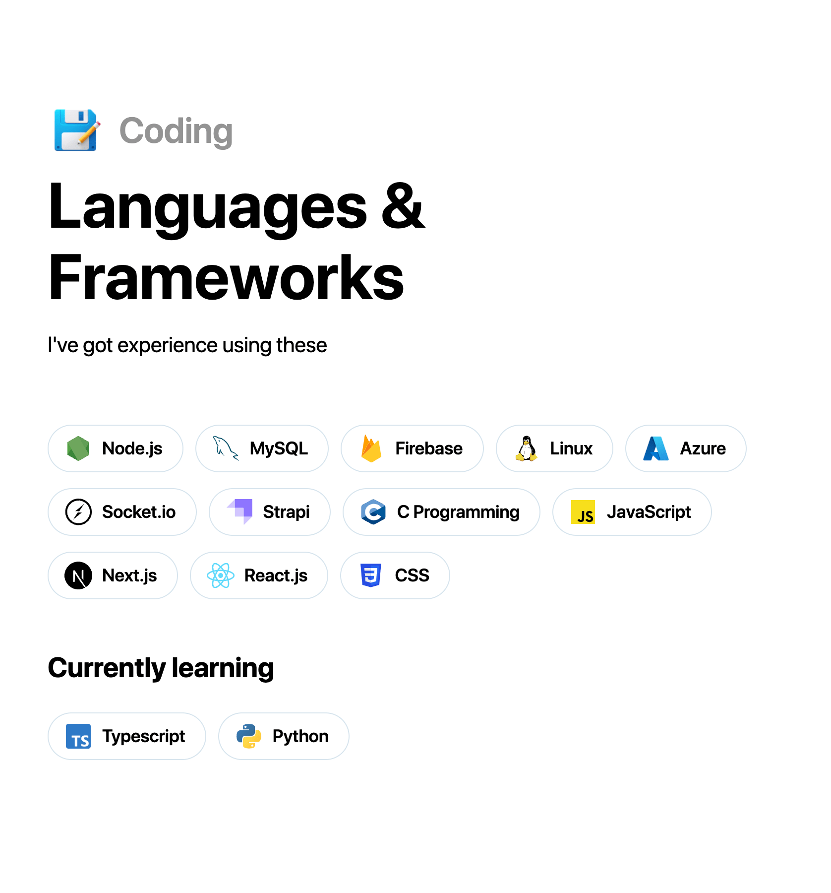

# 🍊 Shailesh Madne Portfolio

<p>
  
  <a href="https://github.com/emanuelchristo" target="_blank">
    
  </a>
  <a href="https://instagram.com/emanuel.christo" target="_blank">
    
  </a>
</p>

> Portfolio website built to showcase my skills and projects

### ⭐️ [Live website](https://ecris.in/)

## 🏙 Screenshots





## 💿 Usage

```sh
# install dependencies
$ yarn install

# serve with hot reload at localhost:3000 for dev
$ yarn dev

# build for production
$ yarn build
```

## 🧑‍💻 Author

- Shailesh Madne
